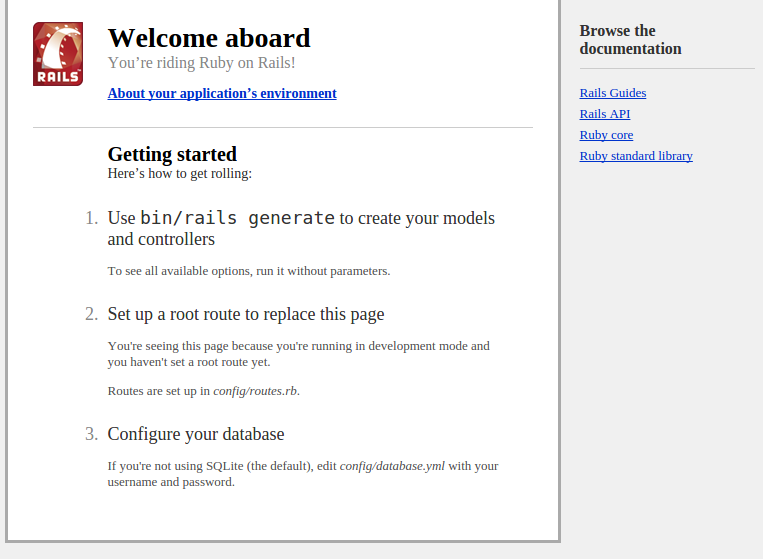

# Scaffolding your App

In this chapter we'll create our Rails app, or the basic scaffold of it at least.

## Run Rails new

Once you have installed the Rails Gem you now have access to Rails commands.

Let's use a simple but powerful one, `rails new`.

This command creates the basic Rails app boilerplate. In your terminal, run the following command:

```
$ rails new approach
```

This command will create a new Rails app and directory called `approach` and within that directory, all of the files and directories needed to power our Rails app.

Your command will also install some gems.

Move into your new application's directory.

```
$ cd approach
```

then run the following command:

```
rails s
```

> #### Using Codio?
> If you are using Codio, you'll need to add a flag to make the port bind to 0.0.0.0 rather than localhost. To do this run the following command instead: `rails s -b 0.0.0.0`

The s in this command stands for server. You can write server instead of s, but the shorthand is better and certainly minimizes typos.

One you have run this command you should see Rails and the default WEBrick server warm up. It should output something like in your terminal:

```
=> Booting WEBrick                                                                                                                                         
=> Rails 4.2.5 application starting in development on http://localhost:3000                                                                                  
=> Run `rails server -h` for more startup options                                                                                                          
=> Ctrl-C to shutdown server                                                                                                                               
[2015-11-16 22:27:34] INFO  WEBrick 1.3.1                                                                                                                  
[2015-11-16 22:27:34] INFO  ruby 2.1.5 (2014-11-13) [x86_64-linux]                                                                                         
[2015-11-16 22:27:34] INFO  WEBrick::HTTPServer#start: pid=451 port=3000  
```

This output shows the version of Rails you are running, where your Rails server will accept visitors (`http://localhost:3000`) and how to shut it down (`Ctrl+C`)

Next to some dates, it also provides info on your WEBrick version, version of Ruby and operating system as well as the port the application is running on (`3000`).

Visit the URL it points to, in my example `http://localhost:3000`. Yours may be a little different. If you are using Codio, please refer to the note above and use the additional command. If you are doing this, you can access the port by pressing the Box URL dropdown.

Once you visit this URL you should see the generic starting page for Rails.



Congratulations! Your first Rails app up and running.

If you return to your terminal after visiting the Rails splash page you should see something similar to the below:

```
Started GET "/" for 172.17.42.1 at 2015-11-16 22:27:45 +0000
Processing by Rails::WelcomeController#index as HTML
  Rendered /home/.rbenv/versions/2.1.5/lib/ruby/gems/2.1.0/gems/railties-4.2.5/lib/rails/templates/rails/welcome/index.html.erb (2.1ms)
Completed 200 OK in 28ms (Views: 11.1ms | ActiveRecord: 0.0ms)
```

What's happening here is by visiting the root route of `/` our Rails app looks for a defined route and a controller that handles that route. After that it looks for any assigned methods and view files (HTML etc.) to render.

Now, we've not set anything up. So Rails uses the out of the box `WelcomeController` controller file stored in the Rails Gem and the index method within the `WelcomeController` - indicated by `#index` - to render the welcome splash page view.

> If these terms of controller, view, method are a touch confusing it is worth going over the [Getting Started with Rails Guide](http://guides.rubyonrails.org/getting_started.html) to get used to those terms

We've not done anything special here but before we move onto the next chapter and start doing something interesting, let's sort our our `gemfile`.

## Set up the gemfile

The only thing we need to do now is remove the Coffeescript gem. Your cleaned up gemfile should look something like:

```
source 'https://rubygems.org'

gem 'rails', '4.2.5'
gem 'sqlite3'
gem 'sass-rails', '~> 5.0'
gem 'uglifier', '>= 1.3.0'
gem 'jquery-rails'
gem 'turbolinks'
gem 'jbuilder', '~> 2.0'
gem 'sdoc', '~> 0.4.0', group: :doc

# Use ActiveModel has_secure_password
# gem 'bcrypt', '~> 3.1.7'

group :development, :test do
  gem 'byebug'
end

group :development do
  gem 'web-console', '~> 2.0'
  gem 'spring'
end
```

if it isn't completely identical, that should be fine. Just ensure to remove the `coffeescript` gem.

We are removing the coffeescript gem because it generates ```.coffee``` files rather than ```.js``` files. 

> Coffeescript is a language that "compiles" into JavaScript. Basically, CoffeeScript is a shorthand version of JavaScript, which uses space in a file to remove the need for brackets and semi-colons.
> Personally, I don't feel a need for CoffeeScript and though many people are very productive with it, Rails and the many things you need to be productive with it are enough to deal with, nevermind using something other than JavaScript

## Bundle Install

After removing the ```rails-coffeescript``` Gem we need to update our Rails gem bundle. To do this, run the bundle install command like so:

```
$ bundle install
```

This will install your gems, and if none are ready to install it will highlight that your bundle is complete. Every time you update your gemfile you need to run the bundle command.

## Install Sqlite

In this book we are going to use Sqlite.

Sqlite is a SQL database that creates a local ```.sqlite``` file on your fileserver which stores your database.

Sqlite is basically what powers Android applications. It is not as robust or scalable as MySQL or Postgresql but if your app is small, it will be more than good enough. [For more information about when to use Sqlite, see the Sqlite website](https://www.sqlite.org/whentouse.html)

To install Sqlite, [you need to download the file for your distribution from the website](https://www.sqlite.org/download.html) and install it.

If you have a problem getting sqlite to run, google ```install sqlite {{your operating system}}``` which should return decent documentation.

#### Installing Sqlite on Debian and Ubuntu

To install Sqlite on Debian systems, including Ubuntu, it is a case of using the ```apt-get``` system. Run the following command:

```
$ sudo apt-get install sqlite3 libsqlite3-dev
```

#### Installing Sqlite on Codio

If you are using Codio to follow along with this tutorial, run the following command:

```
$ parts install sqlite3
```

#### Installing Sqlite on Windows

## Connect the database

## Create the DB using Rake

## Run Rails S